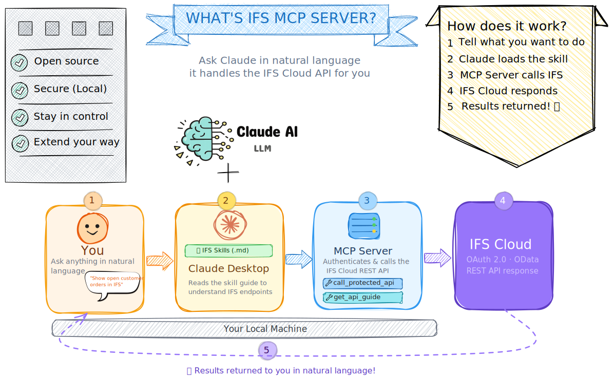

# IFS MCP Server

Connect Claude to your IFS Cloud instance and interact with your ERP through natural conversation.

---

## The Idea

What if you could automate your IFS Cloud tasks without buying anything extra? No new subscriptions, no new platforms, no developers needed.

Install the extension, teach Claude some IFS skills, and then use it in your everyday life. Think of it as a coworker who never gets tired of the repetitive stuff.

The best part? You stay in control. You decide what the agent knows, how it behaves, and what it can do — the possibilities are only limited by your imagination.

> [!NOTE]
> This product is not affiliated with IFS. It is a personal project by [Damith](https://dsj23.me). 

> [!WARNING]
> This product is not a production-ready solution and should not be used in a production environment. It is a proof of concept for creating a personal AI agent for IFS.
---

## How It Works

Think of the IFS MCP server as a broker between Claude LLM and IFS Cloud. It can translate your questions into IFS API calls and bring the data from IFS. In order to understand what IFS Cloud API to call and to construct the message, it needs to know about the IFS endpoint metadata, what we call as **skills**. 

### What is a Skill?

**Skill** is a plain text `.md` file which contains instructions on IFS endpoints, their usage and the data structures. MCP server has instructions to create the file. You just need to tell it what you need!

There are several ways of creating a skill:
* **From a projection name** — Just give Claude the IFS projection name. It fetches the live OpenAPI spec and drafts the skill. Best for master data (customers, suppliers, parts).
* **From a browser recording** — Record your workflow in IFS using DevTools (F12 → Network → Save as HAR). Claude extracts the API calls, asks you to explain each step, and builds the skill. Best for multi-step transactional flows.
* **Import a skill** — If a friend or colleague has created an awesome skill, you can import that skill directly from a URL or local path. Have a look in the [communty IFS MCP skills](https://github.com/knakit/ifs-mcp-skills). You might find some useful skills.

Once you have the **skill** created, use it to perform any action supported by the skill.

> Eg: If you create a skill from PartHandling projection, you can perform any operation related to parts just by telling claude! 

Skills are the brain of the agent. More skills, more things you can do!

Share your skills in [IFS MCP Skills](https://github.com/knakit/ifs-mcp-skills) so others can use them!

---

## Quick Start

* Download the latest `ifs-mcp-server.mcpb` from [GitHub Releases](https://github.com/knakit/ifs-mcp-server-local/releases) and add it as an extension in Claude desktop.
* Build your first skill.
* Now it's ready to use to perform your IFS tasks in Claude desktop!

> **[See the installation guide →](docs/getting-started/INSTALLATION.md)** for complete instructions on IFS OAuth client setup, configuration, first authentication, and building your first skill.

---

## Documentation

### Getting Started
| Document | What's in it |
|----------|--------------|
| [Installation](docs/getting-started/INSTALLATION.md) | Step-by-step setup: OAuth client, extension install, first authentication |
| [Configuration](docs/getting-started/CONFIGURATION.md) | Skills directory setup and security notes |

### Guides
| Document | What's in it |
|----------|--------------|
| [Skill Authoring](docs/guides/SKILL_AUTHORING.md) | How to build, update, and share skills — HAR recordings and OpenAPI specs |

### Reference
| Document | What's in it |
|----------|--------------|
| [Tools & Prompts](docs/reference/TOOLS.md) | Full reference for all tools and prompts |
| [Architecture](docs/reference/ARCHITECTURE.md) | System design and component overview |

### Community
| Document | What's in it |
|----------|--------------|
| [Contributing](CONTRIBUTING.md) | How to contribute skills, report bugs, or develop the server |
| [Security](SECURITY.md) | Data handling, responsible use, and vulnerability reporting |

---

Built with the help of [Claude Code](https://claude.ai/claude-code). Shared with love for the IFS Community 💜