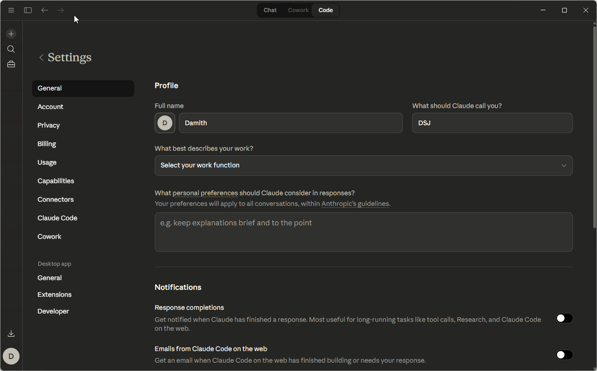

# Installation

## Prerequisites

- [Claude Desktop](https://claude.ai/download)
- An IFS Cloud instance with a public OAuth 2.0 client (Client ID + Realm)

---

## Step 1 — Create an OAuth Client in IFS Cloud

You need a public OAuth client in your IFS Cloud instance. If one has already been set up for this tool, skip to Step 2.

> If you don't have access to the IAM screen, ask your IFS administrator to create the client for you.

In IFS Cloud, navigate to: **Access Control → Identity and Access Manager → IAM Clients**

1. Click **New** to open the Create New Client dialog
2. Enter a **Client ID** (e.g. `ifs-mcp-server`) and optionally a description
3. Toggle **Enabled** ON
4. Toggle **Public Client** ON — this is the key setting; no secret will be required
5. Under **Redirect Uri**, click **+** and add:
   ```
   http://localhost:3000/oauth/callback
   ```
6. Click **OK** to save

---
## Step 2 - Create the skills directory
Community maintained skills can be found in the github repository [IFS Skills](https://github.com/knakit/ifs-mcp-skills). You can clone the repository or create an empty folder to same the skill files.

## Step 3 — Install the Extension

Download the latest `ifs-mcp-server.mcpb` from the [GitHub Releases](https://github.com/knakit/ifs-mcp-server-local/releases) page.

**Install in Claude Desktop:**

1. Open **Claude Desktop**
2. Go to **Settings → Extensions → Advanced settings**
3. Click **Install Extension** and select the downloaded `.mcpb` file
4. When prompted, enter:
   - **IFS Cloud URL** — IFS instance URL (e.g. `https://your-tenant.ifs.cloud`)
   - **OAuth Realm** — IFS namespace. You can find it in Solution Manager → Setup → System Parameters → Parameter = Namespace
   - **OAuth Client ID** — The client ID from Step 1
5. Click **Install**



> **Optional:** Set the **Skills Directory** to keep skills in a separate folder (e.g. a shared git repo). See [CONFIGURATION.md](CONFIGURATION.md) for details.

---

## Step 4 — Authenticate

1. In Claude Desktop, ask Claude to run `start_oauth`
2. A browser window opens — log in with your IFS Cloud credentials
3. After successful login, the browser shows a confirmation and you can close it
4. Your session is saved automatically and persists across restarts

**Verify it worked:**
```
Ask Claude: "Run get_session_info"
```
You should see an active session with your IFS Cloud instance.

---

## Step 5 — Build Your First Skill

The server ships with a built-in OData reference guide, but to work with your specific IFS workflows you need to create at least one skill. Skills teach Claude which endpoints exist, what fields to use, and what the data means.

**Quick start — build from OpenAPI spec:**

Ask Claude:
```
Build IFS skill for projection: CustomerHandling
Filename: ifs-customers.md
Skill name: ifs-customers
```

Claude fetches the spec from your IFS instance, asks a few questions about what the fields mean, and saves the skill automatically.

**For transactional workflows** (orders, approvals, multi-step processes), use a HAR recording instead — see the [Skill Authoring Guide](../guides/SKILL_AUTHORING.md) for full instructions.

---

## Next Steps

- [Skill Authoring Guide](../guides/SKILL_AUTHORING.md) — learn how to build skills from HAR recordings and OpenAPI specs
- [Configuration](CONFIGURATION.md) — set up a persistent skills directory
- [Tools Reference](../reference/TOOLS.md) — full reference for all available tools and prompts
