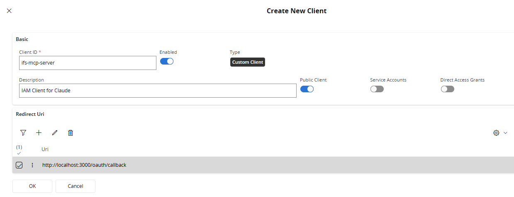
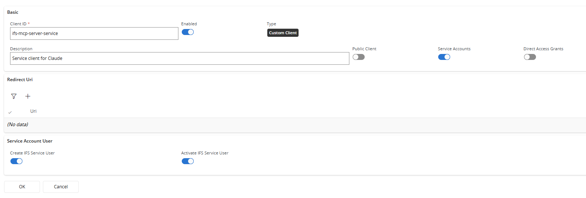
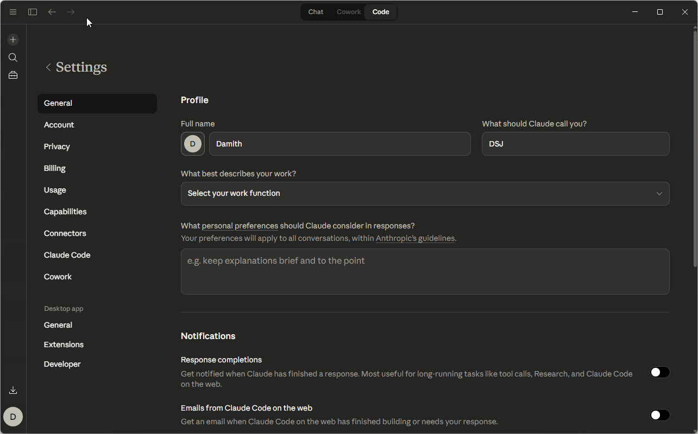
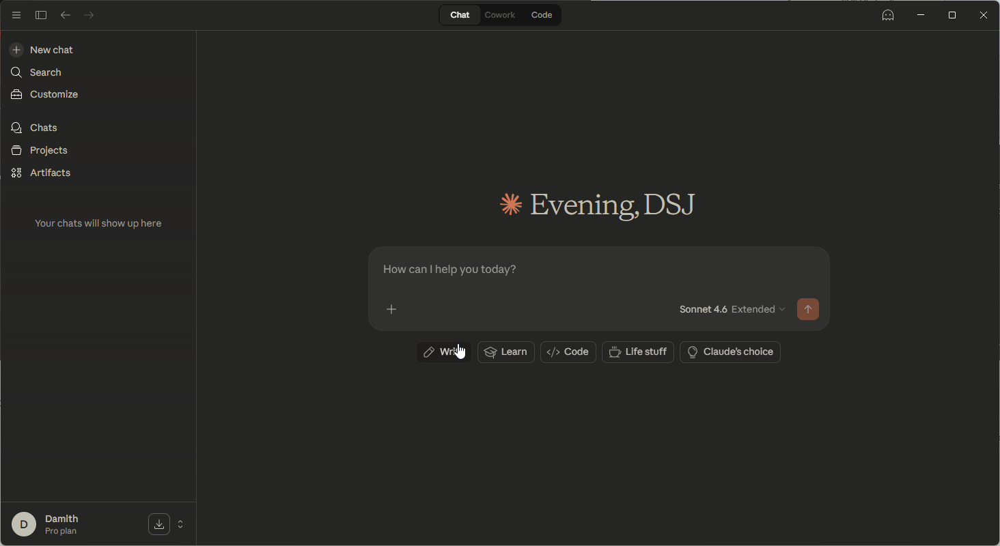

# Installation

## Prerequisites

- [Claude Desktop](https://claude.ai/download), [Claude Code](https://claude.ai/claude-code), **or** [Codex CLI](https://developers.openai.com/codex/) — pick one, or use several against the same IFS instance
- An IFS Cloud instance with a public OAuth 2.0 client (Client ID + Realm)

---

## Step 1 — Create an OAuth Client in IFS Cloud

You need an OAuth client in your IFS Cloud instance. Which kind depends on how you plan to authenticate — see [Managing IFS Environments](ENVIRONMENTS.md) if you're not sure which fits. If a client has already been set up for this tool, skip to Step 2.

> If you don't have access to the IAM screen, ask your IFS administrator to create the client for you.

In IFS Cloud, navigate to: **Access Control → Identity and Access Manager → IAM Clients**

### Option A — Public client, for interactive login (`authorization_code`)

The default mode. A person logs in through a browser, so no client secret is stored anywhere.

1. Click **New** to open the Create New Client dialog
2. Enter a **Client ID** (e.g. `ifs-mcp-server`) and optionally a description
3. Toggle **Enabled** ON
4. Toggle **Public Client** ON — this is the key setting; no secret will be required
5. Under **Redirect Uri**, click **+** and add:
   ```
   http://localhost:3000/oauth/callback
   ```
6. Click **OK** to save



### Option B — Confidential client, for headless auth (`client_credentials`)

Only needed if you'll register an environment with `authMode: "client_credentials"` — no browser involved, so this is what makes headless/automated use (including Claude Cowork) possible. Skip this unless you specifically need it.

1. Click **New** to open the Create New Client dialog
2. Enter a **Client ID** (e.g. `ifs-mcp-server-service`) and a description
3. Toggle **Enabled** ON
4. Leave **Public Client** OFF and **Direct Access Grants** OFF
5. Toggle **Service Accounts** ON — this is the key setting; it's what enables the `client_credentials` grant
6. No **Redirect Uri** is needed — this client never sends a browser through a login page
7. Under **Service Account User**, toggle both **Create IFS Service User** and **Activate IFS Service User** ON — IFS creates a dedicated user for this client to act as
8. Click **OK** to save, then **copy the generated Client Secret immediately** — some IAM screens only display it once



> [!IMPORTANT]
> A freshly created service user has **no IFS permissions by default**. Before this client can call anything, grant its service user the Permission Sets needed for the projections your skills use — the same way you'd authorize any other IFS user (**Users → Permission Sets**, or the equivalent screen in your IFS version). Without this step, authentication will succeed but every API call will fail with a permissions error.

---
## Step 2 - Create the skills directory
Create a folder in your PC to save the skill files.

> [!TIP]
> Community maintained skills can be found in the github repository [IFS Skills](https://github.com/knakit/ifs-mcp-skills). You can download them and use the skill folder. 

## Step 3 — Install the Server

Same server every time — pick the option that matches your host.

### Option A — Claude Desktop

Download the latest `ifs-mcp-server.mcpb` from the [GitHub Releases](https://github.com/knakit/ifs-mcp-server-local/releases) page.

1. Open **Claude Desktop**
2. Go to **Settings → Extensions → Advanced settings**
3. Click **Install Extension** and select the downloaded `.mcpb` file
4. When prompted, enter:
   - **IFS Cloud URL** — IFS instance URL (e.g. `https://your-tenant.ifs.cloud`)
   - **OAuth Realm** — IFS namespace. You can find it in Solution Manager → Setup → System Parameters → Parameter = Namespace
   - **OAuth Client ID** — The client ID from Step 1
5. Click **Install**



> **Optional:** Set the **Skills Directory** to keep skills in a separate folder (e.g. a shared git repo). See [CONFIGURATION.md](CONFIGURATION.md) for details.

### Option B — Claude Code

There's no settings dialog for a Code plugin, so the IFS URL/realm/client ID from Step 1 are registered as a named **environment** through chat instead of a form.

1. Clone this repo, then `npm install && npm run build`
2. Add it as a plugin marketplace and install it:
   ```
   claude plugin marketplace add /path/to/ifs-mcp-server-local
   claude plugin install ifs-mcp-server@ifs-local
   ```
3. In a `claude` session, ask Claude to register your instance — e.g. *"add an IFS environment called prod, url https://your-tenant.ifs.cloud, realm yourrealm, client id from Step 1"*. This calls `add_ifs_environment` and makes it the active environment automatically.
4. See **[Managing IFS Environments](ENVIRONMENTS.md)** for adding more than one instance, `client_credentials` (headless) auth, and the read-only safety flag.

### Option C — Codex CLI

Codex has no plugin/marketplace layer — it's a direct MCP server registration, nothing else to install.

1. Clone this repo, then `npm install && npm run build`
2. Register the server:
   ```
   codex mcp add ifs -- node /absolute/path/to/ifs-mcp-server-local/build/index.js
   ```
   (or add the equivalent `[mcp_servers.ifs]` table to `~/.codex/config.toml` by hand)
3. Run `codex`, then `/mcp` to confirm `ifs` is connected
4. Register your IFS instance the same way as Claude Code — ask Codex to add an environment. See **[Managing IFS Environments](ENVIRONMENTS.md)**.

> Codex has no prompt/slash-command surface for MCP-declared prompts, so the three skill-building prompts aren't available as a guided flow here — call `get_api_guide`, `parse_har_file`, or `read_openapi_file` directly and drive the skill-building conversation yourself. See [Skill Authoring](../guides/SKILL_AUTHORING.md).

---

## Step 4 — Authenticate

1. In Claude Desktop, ask Claude to login to IFS. *(Yes, it's that simple!)*
2. A browser window opens — log in with your IFS Cloud credentials
3. After successful login, the browser shows a confirmation and you can close it.
4. Say ```done``` or something similar to let Claude know you have completed the login.

**Verify it worked:**

Ask Claude: *Check the IFS session status*

Claude will show the session information and the status.

---

## Step 5 — Build Your First Skill

The server ships with a built-in OData reference guide, but to work with your specific IFS workflows you need to create at least one skill. Skills teach Claude which endpoints exist, what fields to use, and what the data means.

**Quick start — build from OpenAPI spec:**

The simplest path for master data projections. Just know the projection name and use the `build_ifs_skill_from_projection` prompt.




Example prompt inputs:
- Projection name: `SupplierHandling` → skill name: `ifs-procurement-suppliers`
- Projection name: `CustomerHandling` → skill name: `ifs-sales-customers`

Claude fetches the spec from your IFS instance, asks a few questions about what the fields mean, and saves the skill automatically.

Once the skill file is created, you can ask questions in natural language.

Eg:

```Show me IFS suppliers with name ABC Corp```

```
Create a new supplier in IFS
Name: XYZ Corp
Country: USA
Language: English
```
Easy as that!

---

## Next Steps

- [Managing IFS Environments](ENVIRONMENTS.md) — add more instances, or use `client_credentials` for headless auth
- [Skill Authoring Guide](../guides/SKILL_AUTHORING.md) — learn how to build skills from HAR recordings and OpenAPI specs
- [Configuration](CONFIGURATION.md) — set up a persistent skills directory
- [Tools Reference](../reference/TOOLS.md) — full reference for all available tools and prompts
